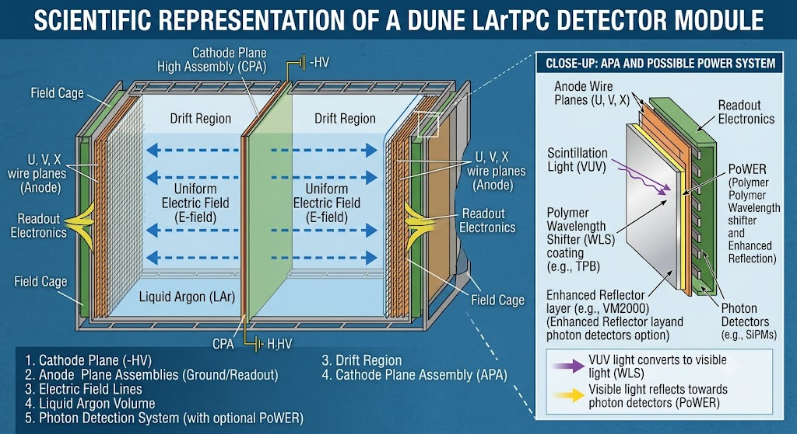
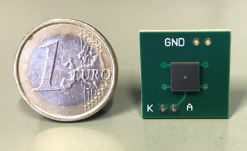
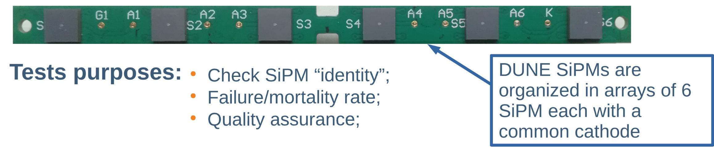

# DUNE/PoWER — Sistema de Fotodetecção

Este documento apresenta uma visão geral do experimento DUNE, do detector LArTPC e do sistema de fotodetecção PoWER — base do trabalho desenvolvido pelo grupo. Para detalhes sobre a simulação, consulte [`darthdune.md`](./darthdune.md) e [`geant4.md`](./geant4.md).

O DUNE (Deep Underground Neutrino Experiment) é um experimento de física de partículas de grande escala localizado no Laboratório Nacional de Fermilab (EUA) e no Sanford Underground Research Facility (SURF), Dakota do Sul. Seu principal objetivo é estudar oscilações de neutrinos, investigar a assimetria entre matéria e antimatéria no setor leptônico e detectar neutrinos provenientes de supernovas galácticas.

O detector do DUNE é baseado na tecnologia LArTPC (Liquid Argon Time Projection Chamber), que utiliza argônio líquido como meio ativo de detecção. Seus principais componentes são:

- Cátodo (CPA — Cathode Plane Assembly): plano central em alta tensão negativa responsável por gerar o campo elétrico de deriva.
- Ânodo (APA — Anode Plane Assembly): planos de fios nas extremidades do detector, responsáveis pela leitura do sinal de carga.
- Field Cage: estrutura que envolve o volume ativo, garantindo a uniformidade do campo elétrico de deriva entre o cátodo e o ânodo.
- Região de Deriva (Drift Region): volume de argônio líquido onde os elétrons de ionização gerados pelas interações se movem em direção ao ânodo.
- Sistema de Detecção de Fótons (PDS): responsável pela detecção da luz de cintilação emitida pelo argônio.

*Figura 1: Representação científica de um módulo detector LArTPC do DUNE. À direita, detalhe do sistema PoWER acoplado ao plano de ânodo.*

## Sistema de Detecção de Fótons (PDS)

Além do sinal de carga, o LArTPC detecta a luz de cintilação emitida pelo argônio durante as interações. Essa informação complementar permite obter o instante preciso do evento (*t₀*), melhorar a reconstrução de energia e rejeitar ruídos de fundo. A eficiência mínima exigida para o PDS do DUNE é de Rendimento de luz médio mínimo (*Light Yield*) de 20 PE/MeV no volume ativo e um mínimo localmaior ou igual a 0,5 PE/MeV em qualquer ponto do detector

> *Light Yield* refere-se à quantidade de fotoelétrons detectados por energia depositada (PE/MeV).

Neutrinos interagem com o argônio líquido dentro da field cage, fazendo com que o meio emita luz de cintilação em 128 nm (ultravioleta de vácuo, VUV). Nesse comprimento de onda, a luz sofre intenso espalhamento Rayleigh no argônio líquido, limitando significativamente o livre caminho médio dos fótons. Uma das formas de diminuir esse efeito é dopar o LAr com uma pequena concentração de xenônio líquido(LXe). O xenônio desloca o comprimento de onda da emissão de 128 nm para 173 nm, espectro em que o espalhamento Rayleigh é consideravelmente menor e o livre caminho médio dos fótons é maior e também atua como compensador para perdas de luz causadas por contaminantes, como traços de nitrogênio e oxigênio.

## O Sistema PoWER

O PoWER (Polymer Wavelength Enhanced Reflector) é um sistema de conversão e reflexão de luz desenvolvido para aumentar o rendimento e a uniformidade da detecção de fótons no DUNE.

### Princípio de funcionamento

O PoWER converte a luz de cintilação UV do argônio em luz visível, que possui comprimento de espalhamento Rayleigh muito maior no LAr, permitindo que os fótons percorram distâncias maiores até atingir os detectores. O sistema é composto por duas camadas instaladas sobre a field cage:

| Camada | Material | Espessura | Função |
|---|---|---|---|
| Conversora | PEN — *PolyEthylene Naphthalate* | 0,1 mm | Converte a luz VUV (128/173 nm) em luz visível |
| VETO | Acrílico | 1 mm | Bloqueia a reentrada de luz de eventos fora do volume ativo |

Adicionalmente, uma camada de do material ESR (Enhanced Specular Reflector) são instalados, oferecendo ≥ 95% de refletividade no espectro visível, aumentando a probabilidade de os fótons convertidos alcançarem os detectores.

O comportamento do sistema varia conforme a localização do evento de interação:

*Figura 2: (a) Evento no volume ativo — a luz VUV incidente sobre a field cage é convertida em visível pelo PEN e refletida pelo ESR em direção aos SiPMs. (b) Evento no LAr buffer — a luz VUV é bloqueada pela camada de acrílico (VETO) e não é convertida, sendo eventualmente absorvida ou detectada pelos detectores VUV.*

a) Evento no volume ativo (active volume):
A luz de cintilação que se propaga em direção à field cage ou ao cátodo é absorvida pelo PEN e reemitida como luz visível. O ESR reflete essa luz de volta em direção aos detectores, maximizando o rendimento.

b) Evento no LAr buffer (entre o cátodo e os detectores):
A camada de acrílico funciona como um VETO ótico: a luz VUV proveniente dessa região é bloqueada e não é convertida pelo PEN, impedindo que eventos externos ao volume ativo contaminem a leitura. A luz remanescente pode ser detectada pelos detectores sensíveis a VUV.

## Detectores SiPM

Os detectores utilizados no PDS são SiPMs (Silicon Photomultipliers) — fotodetectores de estado sólido de alta sensibilidade e ganho. No contexto do DUNE, cada SiPM possui dois LDUs (light Detection Units):

- LDU externo: absorção de luz visível (fótons convertidos pelo PoWER/PEN);
- LDU interno: sensível à luz VUV, responsável pela detecção direta da cintilação não convertida.

Os SiPMs do DUNE são organizados em arranjos de 6 unidades compartilhando um cátodo comum, facilitando a leitura e o controle de qualidade.

*Figura 3: SiPM individual. A moeda de 1 euro (diâmetro: 23,25 mm) ilustra a escala reduzida do detector.*

*Figura 4: Arranjo de 6 SiPMs com cátodo comum. Os testes realizados nos arranjos visam verificar a identidade elétrica dos dispositivos, medir a taxa de falha e garantir a qualidade antes da instalação.*

## Simulação com darthdune

O programa darthdune, desenvolvido pelo Prof. André, tem como objetivo simular o transporte de fótons dentro da field cage com o sistema PoWER acoplado, com o intuito de obter o light yield em função da posição do evento e dos parâmetros dos materiais envolvidos.

Os parâmetros testados na simulação incluem:

- Absorção e comprimento de atenuação dos materiais
- Índice de refração em função do comprimento de onda
- Espectro de emissão do PEN
- Eficiência quântica dos SiPMs

O programa é desenvolvido utilizando o framework Geant4 para simulação de transporte de partículas e fótons. Para mais detalhes sobre a implementação e como executar as simulações, consulte [`darthdune.md`](./darthdune.md) e [`geant4.md`](./geant4.md).

*Documentação elaborada pelo grupo de pesquisa — CBPF/DUNE. Para dúvidas ou contribuições, abra uma issue no repositório.*
